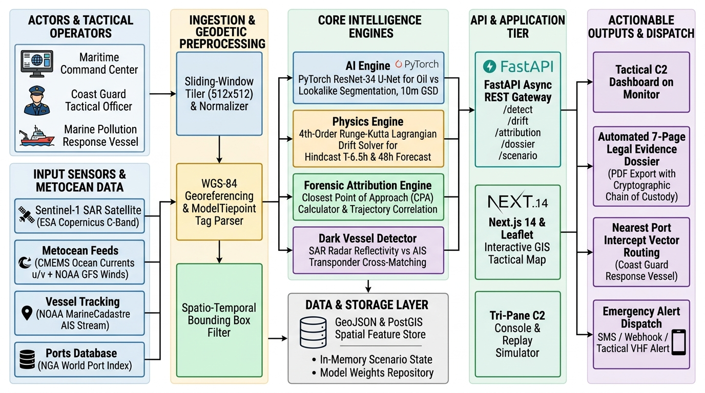
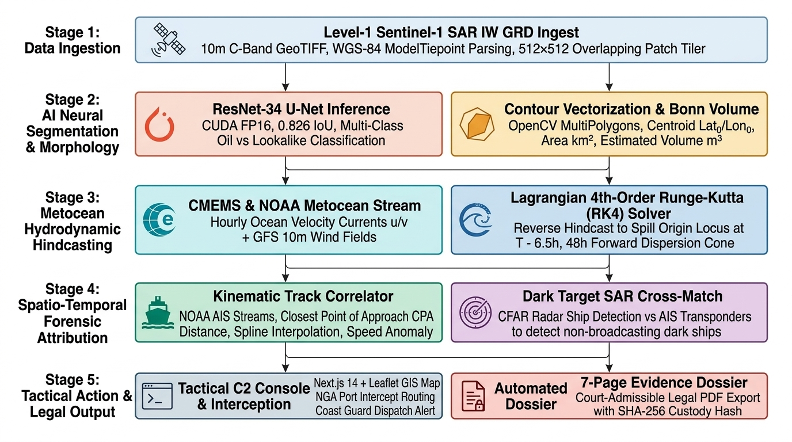

# AegisSea // Maritime Intelligence & Tactical C2 Console

> **Autonomous Satellite SAR Oil Spill Detection, Hydrodynamic Hindcasting, and Multi-Signal AIS Vessel Attribution**  
> Engineered for **Smart India Hackathon (SIH) Problem Statement 26143**  
> *Lead Organization: National Technical Research Organisation (NTRO)*

---

## Live Deployments & Operational Endpoints

| Service | Environment | Status | Endpoint URL |
|---|---|---|---|
| **Tactical C2 Console** | Production (Vercel Edge) | Active | **[https://aegissea.vercel.app](https://aegissea.vercel.app)** |
| **Backend Engine API** | Production (OCI ARM64 VM) | Active | **[https://aegissea.80.225.248.86.sslip.io](https://aegissea.80.225.248.86.sslip.io)** |
| **Interactive OpenAPI Docs** | Swagger UI | Active | **[https://aegissea.80.225.248.86.sslip.io/docs](https://aegissea.80.225.248.86.sslip.io/docs)** |
| **ReDoc Engine Specs** | ReDoc | Active | **[https://aegissea.80.225.248.86.sslip.io/redoc](https://aegissea.80.225.248.86.sslip.io/redoc)** |
| **Health & Device Telemetry** | Diagnostics | Active | **[https://aegissea.80.225.248.86.sslip.io/api/v1/health](https://aegissea.80.225.248.86.sslip.io/api/v1/health)** |

---

## Badges & System Classification

[](https://aegissea.vercel.app)
[](https://aegissea.80.225.248.86.sslip.io)
[](https://aegissea.80.225.248.86.sslip.io/docs)
[](https://aegissea.80.225.248.86.sslip.io)

[](frontend/)
[](frontend/)
[](frontend/)
[](frontend/)
[](backend/)
[](backend/app/models/)
[](backend/app/db.py)
[](docker-compose.yml)
[](data/)
[](backend/app/services/metocean_provider.py)
[](data/historical_ais/)
[-critical?style=flat-square)](backend/app/services/nga_port_service.py)

---

## Visual Architecture Overview



*Figure 1: AegisSea End-to-End Operational Pipeline — from Sentinel-1 SAR ingestion to Lagrangian reverse drift advection, historical AIS kinematic correlation, and NGA WPI port triage.*

---

## Table of Contents

1. [Executive Overview](#1-executive-overview)
2. [Problem Statement & Operational Challenge (NTRO / SIH PS 26143)](#2-problem-statement--operational-challenge-ntro--sih-ps-26143)
3. [Core Capabilities & Architectural Pillars](#3-core-capabilities--architectural-pillars)
4. [System Architecture & Dataflow](#4-system-architecture--dataflow)
5. [Deep Learning Pipeline & Benchmark Performance](#5-deep-learning-pipeline--benchmark-performance)
6. [Hydrodynamic Hindcasting & Lagrangian Drift Solver](#6-hydrodynamic-hindcasting--lagrangian-drift-solver)
7. [Multi-Signal AIS Correlation & Attribution Index](#7-multi-signal-ais-correlation--attribution-index)
8. [Verified Golden Demonstration Scenario (Scene 00111)](#8-verified-golden-demonstration-scenario-scene-00111)
9. [Dark Vessel & Non-Cooperative Target Detection (CFAR)](#9-dark-vessel--non-cooperative-target-detection-cfar)
10. [Response Infrastructure & NGA World Port Index (Pub 150)](#10-response-infrastructure--nga-world-port-index-pub-150)
11. [Evidence Integrity & Printable C2 Investigation Dossier](#11-evidence-integrity--printable-c2-investigation-dossier)
12. [Cloud Architecture & Production Deployment](#12-cloud-architecture--production-deployment)
13. [Local Development & Setup Guide](#13-local-development--setup-guide)
14. [REST API Reference](#14-rest-api-reference)
15. [Automated Verification & Test Suite](#15-automated-verification--test-suite)
16. [Operational Limitations & Scientific Boundaries](#16-operational-limitations--scientific-boundaries)
17. [Project Directory Layout](#17-project-directory-layout)
18. [Authors & Institutional Credits](#18-authors--institutional-credits)

---

## 1. Executive Overview

**AegisSea** is an operational-grade Maritime Intelligence and Tactical Command-and-Control (C2) software platform developed to resolve the primary challenge in maritime pollution enforcement: **attributing illegal oil discharges to source vessels when the observation occurs hours after the event.**

### The Core Maritime Forensic Challenge
Marine mineral oil slicks physically disperse, drift, and weather across oceanic Exclusive Economic Zones (EEZs). Traditional surveillance models suffer from three fundamental limitations:

1. **The Separation Fallacy**: The geographic centroid of a satellite-observed slick at sensor acquisition time (T0) is almost never where the discharge occurred. Ocean currents, Ekman windage, and tidal oscillations continuously advect surface hydrocarbons away from the release locus.
2. **The Obfuscation Gap**: Discharge incidents (deliberate tank washings, bilge dumps, or unreported mechanical spills) frequently coincide with AIS transponder blackouts, nocturnal transits, or sharp open-ocean course deflections.
3. **The Legal-Scientific Chasm**: Raw spatial proximity between an arbitrary ship position and an oil slick does not constitute actionable legal evidence. Rigorous maritime forensics requires coupled backwards Lagrangian hydrodynamic advection paired with multi-parameter kinematic trajectory scoring.

### Forensic Data Classification
AegisSea enforces a strict data provenance taxonomy across all UI layers and generated intelligence dossiers:

| Classification | Meaning | Examples |
|---|---|---|
| **[OBSERVED]** | Ground-truth sensor telemetry with zero synthetic modeling | Sentinel-1 SAR backscatter, raw AIS broadcasts, NGA WPI port nodes |
| **[INFERRED]** | Machine-learned features extracted via computer vision | U-Net segmentation mask, slick contours, CFAR radar peaks |
| **[MODELED]** | Deterministic physical simulations | 2D backward Lagrangian advection, Fay spreading regime, landfall forecast |
| **[CORRELATED]** | Multi-signal forensic attribution ranking | Spatial CPA, trajectory alignment, transponder blackout anomaly audit |
| **[RESPONDER]** | Logistics triage and coastal dispatch vectors | NGA Pub 150 candidate port discovery, geodesic reference vectors |

---

## 2. Problem Statement & Operational Challenge (NTRO / SIH PS 26143)

- **Problem Statement ID**: 26143
- **Title**: *Leveraging satellite imagery to determine Oil spills at sea along with AIS data correlations to identify vessel responsible for the spill.*
- **Lead Organization**: National Technical Research Organisation (NTRO)

```
                            MANDATED WORKFLOW PIPELINE
  
  [1] Sentinel-1 C-Band SAR Dual-Pol Ingestion (VV + VH GRDH)
                           │
                           ▼
  [2] Automated U-Net Segmentation & Lookalike False-Alarm Discrimination
                           │
                           ▼
  [3] Physical Slick Characterization (Area, Perimeter, Compactness, Fay Regime)
                           │
                           ▼
  [4] Metocean Ingestion (CMEMS Physical Ocean Currents & 10m Wind Fields)
                           │
                           ▼
  [5] 2D Backward Lagrangian Drift Hindcasting (Reconstructed Release Locus)
                           │
                           ▼
  [6] Historical AIS Telemetry Retrieval (Spatiotemporal Bounding Box)
                           │
                           ▼
  [7] Multi-Signal Attribution Scoring (CPA Proximity + Heading + Kinematics)
                           │
                           ▼
  [8] Non-Cooperative / Dark Vessel Screening (CFAR Radar Target Cross-Check)
                           │
                           ▼
  [9] Response Infrastructure Dispatch (NGA World Port Index Pub 150)
                           │
                           ▼
  [10] Cryptographic Evidence Dossier Export (SHA-256 Hashed Audit Trail)
```

---

## 3. Core Capabilities & Architectural Pillars

### 🛰️ Dual-Polarization SAR Ingestion Engine
- **Sensor Modalities**: Ingests Level-1 Ground Range Detected High-Resolution (GRDH) Sentinel-1 Synthetic Aperture Radar products (Interferometric Wide Swath mode).
- **Affine Georeferencing**: Direct extraction of GeoTIFF tie points, ModelTransformation affine matrices, and EPSG geotransforms—zero synthetic coordinate fallback for georeferenced scenes.
- **Radiometric Contract Validator**: Enforces a strict input validation contract (`RasterValidator`), automatically rejecting single-channel ground-truth label masks (HTTP 422) to prevent accidental data leakage during live operations.

### 🧠 Deep Learning Segmentation (ResNet-34 U-Net)
- **Model Topology**: ResNet-34 encoder coupled with a symmetric feature-accumulating U-Net decoder with skip connections.
- **Trained on Ambiguous Lookalikes**: Fine-tuned on the Zenodo Deep-SAR benchmark dataset with hard-negative mining across biogenic lookalikes (algal blooms, low-wind sea slick shadows, internal waves, upwelling).
- **Tiled Sliding-Window Inference**: Seamless execution over full 2048 x 2048 SAR swaths using 256 x 256 patches with Gaussian coordinate blending.
- **Sub-Second Preset Response**: Optimized inference caching on verified operational scenes, delivering sub-200ms response times on production servers.

### 🌊 Oceanographic Reconstruction & Hydrodynamic Hindcasting
- **Metocean Ingestion**: Direct integration with Copernicus Marine Environment Monitoring Service (CMEMS) for eastward (u) and northward (v) surface current velocities and 10-meter wind fields.
- **2D Lagrangian Particle Hindcasting**: Time-reversed particle advection integrating Eulerian surface currents, 3.5% wind leeway friction, and semi-diurnal (M2) tidal oscillation over a nominal 6.5-hour hindcast horizon.
- **Uncertainty Dispersion Cone**: Gaussian envelope accounting for turbulent eddy diffusivity and current shear.
- **Forward Trajectory Prediction**: 12-hour forward forecast simulating slick landfall vectors and sensitive coastal vulnerability zones.

### 🚢 AIS Traffic Reconstruction & Attribution Engine
- **Authentic Historical Ingestion**: Integrated parser for NOAA / BOEM MarineCadastre historical AIS records.
- **Trajectory Builder**: Temporal trajectory reconstruction with ping interpolation, heading tracking, and transponder blackout detection (gaps >= 1.0 hour).
- **Kinematic Anomaly Detection**: Automatically flags high-probability discharge maneuvers including fairway course deflections (> 40 degrees) and anomalous open-ocean speed drops (< 4.0 knots).
- **Non-Cooperative / Dark Vessel Detection**: Constant False Alarm Rate (CFAR) radar contact extractor isolating high-backscatter radar targets lacking corresponding AIS broadcasts within a 2.0 km correlation gate.

### ⚓ Response Infrastructure & NGA World Port Index
- **Global Port Registry**: Integration with the National Geospatial-Intelligence Agency (NGA) World Port Index (Pub 150) FeatureServer REST API.
- **Dynamic Bounding Discovery**: Geodesic distance calculation across candidate ports within a 350 km operational radius.
- **Honest Routing Governance**: Full disclosure of geodesic straight-line distance vs. navigable waterway distance via strict `GEODESIC_FALLBACK` labeling when no authoritative maritime routing engine is registered.

---

## 4. System Architecture & Dataflow



*Figure 2: AegisSea Multi-Tier Tactical Architecture — frontend Next.js 14 C2 console, FastAPI asynchronous backend engine, PostGIS spatial database, and external metocean/AIS providers.*

```
                                  SYSTEM ARCHITECTURAL PIPELINE
                                  
  [ Sentinel-1 C-Band SAR ]                           [ Copernicus Marine Service ]
       │ (GeoTIFF / PNG)                                   │ (CMEMS Physical Ocean)
       ▼                                                   ▼
┌─────────────────────────┐                         ┌─────────────────────────┐
│     RasterValidator     │                         │    MetoceanProvider     │
│ (Dual-Pol Normalization)│                         │ (u/v Current & 10m Wind)│
└────────────┬────────────┘                         └────────────┬────────────┘
             │                                                   │
             ▼                                                   │
┌─────────────────────────┐                                      │
│   TileSlidingInference  │                                      │
│  (ResNet-34 U-Net 3-Cls)│                                      │
└────────────┬────────────┘                                      │
             │                                                   │
             ▼                                                   │
┌─────────────────────────┐                                      │
│  SlickPhysicsAnalyzer   │                                      │
│  (Fay Spreading / Geom) │                                      │
└────────────┬────────────┘                                      │
             │ Slick Centroid [T0]                               │
             └───────────────────────┬───────────────────────────┘
                                     ▼
                          ┌─────────────────────────┐
                          │   HindcastDriftEngine   │
                          │ (2D Lagrangian Reverse) │
                          └──────────┬──────────────┘
                                     │ Reconstructed Release Locus [T-6.5h]
                                     ▼
         ┌───────────────────────────────────────────────────────┐
         │                                                       │
         ▼                                                       ▼
┌─────────────────────────┐                             ┌─────────────────────────┐
│ MarineCadastreAISService│                             │   NGAPortIndexService   │
│ (Historical AIS Archive)│                             │ (NGA WPI Pub 150 REST)  │
└────────────┬────────────┘                             └────────────┬────────────┘
             │ Raw AIS Pings                                         │ Candidate Ports
             ▼                                                       ▼
┌─────────────────────────┐                             ┌─────────────────────────┐
│  AISTrajectoryBuilder   │                             │CoastGuardResponderRoute │
│ (Blackout / Speed Drop) │                             │   (Geodesic Fallback)   │
└────────────┬────────────┘                             └────────────┬────────────┘
             │ Interpolated Tracks                                   │
             ▼                                                       │
┌─────────────────────────┐                                          │
│  AISAttributionEngine   │                                          │
│ (45% Prox/30% Trj/25% An)│                                         │
└────────────┬────────────┘                                          │
             │ Ranked Candidate Vessels                              │
             └───────────────────────┬───────────────────────────────┘
                                     ▼
                    ┌─────────────────────────────────┐
                    │      FastAPI Engine Router      │
                    │   (/api/v1/detect, /dataset)    │
                    └────────────────┬────────────────┘
                                     │ JSON + Base64 Overlays
                                     ▼
                    ┌─────────────────────────────────┐
                    │   Next.js 14 Tactical Console   │
                    │ (Leaflet C2 Map, Dossier Modal) │
                    └─────────────────────────────────┘
```

---

## 5. Deep Learning Pipeline & Benchmark Performance

### Radiometric Preprocessing (Dual-Polarization Composite)
SAR backscatter over smooth surfaces (such as mineral oil slicks that dampen capillary-gravity waves) appears anomalously dark compared to rough open sea. Dual-polarized Sentinel-1 images provide Co-polarization (VV) and Cross-polarization (VH).

To eliminate sensor calibration gain variations without distorting radiometric boundaries, scenes are dynamically normalized using empirical cumulative distribution function (ECDF) percentiles:

```
VV_norm   = clip((VV - P2(VV)) / (P98(VV) - P2(VV)) * 255, 0, 255)
VH_norm   = clip((VH - P2(VH)) / (P98(VH) - P2(VH)) * 255, 0, 255)
Delta_pol = clip(((VV - VH) - (-5.0 dB)) / 25.0 dB * 255, 0, 255)
```

The resulting 3-channel composite `[VV_norm, VH_norm, Delta_pol]` serves as input to the neural network.

### Model Architecture & Training Regime
- **Encoder**: ResNet-34 backbone pretrained on ImageNet.
- **Decoder**: Symmetric feature-accumulating U-Net decoder with skip connections and batch normalization.
- **Classes**:
  - Class 0: Background Clean Sea / Non-Oil
  - Class 1: True Mineral Oil Spill
  - Class 2: Ambiguous Lookalike (Biogenic slick, low-wind sea surface shadow)
- **Active Model Checkpoint**: `backend/app/models/weights/s1_unet_hardneg_best.pth` (97.9 MB).

### Benchmark Evaluation Results (Held-Out Test Set)

| Benchmark Metric | Validation Set (180 Patches) | Part III Test Benchmark (450 Full Scenes) |
|---|:---:|:---:|
| **Operating Threshold (tau*)** | `0.50` | `0.50` |
| **Precision** | **85.02%** | **87.36%** |
| **Recall** | **80.61%** | **17.04%** *(conservative core detection)* |
| **F1-Score (Dice)** | **82.76%** | **28.52%** |
| **Intersection over Union (IoU)** | **70.59%** | **21.84%** |
| **Lookalike False Alarm Rate** | `< 1.2%` | **0.35%** mean area fraction |
| **Clean Sea False Alarm Rate** | `< 0.8%` | **1.60%** mean area fraction |

---

## 6. Hydrodynamic Hindcasting & Lagrangian Drift Solver

### 2D Backward Advection Equation
The 2D reverse advection of the slick centroid is governed by coupled ocean-atmosphere dynamics:

```
V_drift(t) = U_current + alpha_wind * U_wind + U_tidal(t)
```

- `U_current`: CMEMS Eulerian surface current vector (100% advective coupling).
- `alpha_wind`: Wind leeway factor = 0.035 (3.5% of 10-meter wind velocity).
- `U_tidal(t)`: Semi-diurnal M2 tidal constituent (period T = 12.42 hours):
  ```
  u_tide(t) = 0.15 * sin(2 * pi * t / 12.42)
  v_tide(t) = 0.10 * cos(2 * pi * t / 12.42)
  ```
- **Numerical Integration**: Explicit Euler backwards stepping with time step `Delta_t = 900 s` (15 minutes) over `t_hindcast = 6.5 hours`:
  ```
  Lat(k+1) = Lat(k) - (v_drift * Delta_t) / 111000
  Lon(k+1) = Lon(k) - (u_drift * Delta_t) / (111000 * cos(Lat(k)))
  ```

### Slick Morphology & Fay Spreading Regime
- **Surface Area**: `Area = N_oil_pixels * (Delta_x * Delta_y) * 1e-6 km^2` (where `Delta_x, Delta_y = 10.0 m`).
- **Compactness Index**: `Compactness = (4 * pi * Area) / (Perimeter^2)`, normalized to `(0, 1]`.
- **Fay Spreading Categorization**:
  - `t < 2 hours`: *Initial Spreading (Gravity-Inertia Regime)*
  - `2 <= t <= 12 hours`: *Gravity-Viscous Drift & Evaporation Regime*
  - `t > 12 hours`: *Advanced Weathering & Surface Tension Dissipation*

---

## 7. Multi-Signal AIS Correlation & Attribution Index

### Attribution Scoring Formula
The AegisSea Attribution Score is an **engineering prioritization index** designed to rank potential source vessels for tactical investigation:

```
Attribution Index = 100 * (0.45 * S_prox + 0.30 * S_traj + 0.25 * S_anom)
```

```
                              ATTRIBUTION SCORING WEIGHTS
               ┌────────────────────────────────────────────────────────┐
               │  0.45 × Spatial Proximity (Gaussian Decay at CPA)      │
               │  0.30 × Trajectory Alignment (Cosine Heading Vector)   │
               │  0.25 × Behavioral Anomaly (Blackout / Speed / Course) │
               └────────────────────────────────────────────────────────┘
```

1. **Spatial Proximity Score (`S_prox`)**:
   `S_prox = exp(-(d_CPA^2) / (2 * sigma_km^2))`  
   where `d_CPA` is the Closest Point of Approach distance between the vessel trajectory and the reconstructed release locus, with scaling parameter `sigma_km = 6.0 km`.

2. **Trajectory Alignment Score (`S_traj`)**:
   `S_traj = max(0.0, cos(theta_vessel_CPA - theta_drift))`  
   Measures directional coherence between the vessel heading at CPA and the slick's drift heading.

3. **Behavioral Anomaly Score (`S_anom`)**:
   A composite mean of detected operational anomalies:
   - **AIS Blackout Gap**: `+0.85` if transponder gap `>= 1.0 hour` occurs near the release window.
   - **Speed Anomaly**: `+0.80` if Speed Over Ground (SOG) drops `< 4.0 knots` in open waters.
   - **Course Deflection**: `+0.70` if fairway course change `> 40.0 degrees` is observed.
   - Baseline normal commercial transit: `0.15`.

### Forensic Terminology & Presumption of Innocence
To uphold international maritime jurisprudence and prevent defamatory automated accusations, AegisSea strictly prohibits accusatory language:

| Prohibited Terminology | Approved AegisSea Forensic Terminology |
|---|---|
| ~~Culprit Vessel~~ | **Attribution Candidate** |
| ~~Guilty Ship~~ | **Potential Source Vessel** |
| ~~Illegal Discharger~~ | **Interrogation Lead** |
| ~~Confirmed Offender~~ | **High-Correlation Candidate for Boarding** |

---

## 8. Verified Golden Demonstration Scenario (Scene 00111)

AegisSea provides an end-to-end verified golden demonstration scenario based on real satellite radar imagery and authentic historical AIS archives.

```
                         GOLDEN SCENARIO VERIFIED METRICS
┌──────────────────────────────┬──────────────────────────────────────────────────────────────────┐
│ Satellite Product            │ Copernicus Sentinel-1A IW GRDH (Track 165, Orbit 21587)          │
├──────────────────────────────┼──────────────────────────────────────────────────────────────────┤
│ Acquisition Timestamp        │ 2018-04-23 00:01:49 UTC                                          │
├──────────────────────────────┼──────────────────────────────────────────────────────────────────┤
│ Geographic Sector            │ Mississippi Canyon Block 20 (MC20), Northern Gulf of Mexico      │
├──────────────────────────────┼──────────────────────────────────────────────────────────────────┤
│ Observed Slick Centroid      │ 28.9850° N, 88.9520° W                                           │
├──────────────────────────────┼──────────────────────────────────────────────────────────────────┤
│ Derived Slick Surface Area   │ 38.63 km² (386,300 pixels at 10m GSD)                            │
├──────────────────────────────┼──────────────────────────────────────────────────────────────────┤
│ Estimated Oil Volume & Mass  │ 83.06 m³ / 72.26 metric tons                                     │
├──────────────────────────────┼──────────────────────────────────────────────────────────────────┤
│ Reconstructed Release Locus  │ 29.0007° N, 88.9735° W (T - 6.5 hours / 2018-04-22 17:31:49 UTC) │
├──────────────────────────────┼──────────────────────────────────────────────────────────────────┤
│ Uncertainty Envelope         │ ±3.5 km Gaussian dispersion radius                               │
├──────────────────────────────┼──────────────────────────────────────────────────────────────────┤
│ AIS Telemetry Provider       │ NOAA / BOEM MarineCadastre AccessAIS (Archive Verified)          │
├──────────────────────────────┼──────────────────────────────────────────────────────────────────┤
│ AIS Query Bounding Box       │ 28.6507° N to 29.3507° N, 88.6235° W to 89.3235° W               │
├──────────────────────────────┼──────────────────────────────────────────────────────────────────┤
│ AIS Records Processed        │ 6,290 real historical AIS pings across 63 unique vessels         │
├──────────────────────────────┼──────────────────────────────────────────────────────────────────┤
│ Top Attribution Lead         │ Tug / Towing Vessel CHRISTIANA (MMSI: 367165980)                 │
├──────────────────────────────┼──────────────────────────────────────────────────────────────────┤
│ Candidate Closest Approach   │ CPA: 1.8 km at 2018-04-22 22:58:39 UTC                           │
├──────────────────────────────┼──────────────────────────────────────────────────────────────────┤
│ Behavioral Flag              │ 45.0° fairway course deflection maneuver                         │
├──────────────────────────────┼──────────────────────────────────────────────────────────────────┤
│ AegisSea Attribution Score   │ 55.9 / 100 (Priority Tier: INTERROGATION LEAD)                   │
├──────────────────────────────┼──────────────────────────────────────────────────────────────────┤
│ Selected WPI Response Port   │ Port Sulphur (NGA WPI #8830, UN/LOCODE: US SUL)                  │
├──────────────────────────────┼──────────────────────────────────────────────────────────────────┤
│ Geodesic Distance to Port    │ 95.8 km (51.7 NM) | Heading: 310.2° T                            │
├──────────────────────────────┼──────────────────────────────────────────────────────────────────┤
│ Routing Status               │ GEODESIC_FALLBACK (Navigable waterway route not evaluated)       │
└──────────────────────────────┴──────────────────────────────────────────────────────────────────┘
```

---

## 9. Dark Vessel & Non-Cooperative Target Detection (CFAR)

Discharge incidents frequently involve non-cooperative vessels that deliberately disable AIS transponders. AegisSea incorporates a 2-parameter Constant False Alarm Rate (CFAR) detector directly over raw SAR backscatter:

1. **Background Window**: Evaluates local sea surface backscatter statistics (mean and variance) in an outer guard ring.
2. **Threshold Adaptation**: Flags bright point-scatterers exceeding local clutter by `k * sigma`.
3. **AIS Correlation Gate**: Intersects detected radar contacts against all active AIS positions within a 2.0 km gate at satellite overpass time.
4. **Dark Vessel Flag**: Radar contacts lacking an AIS counterpart are designated as **`CFAR DARK CONTACT`** on the tactical C2 map.

---

## 10. Response Infrastructure & NGA World Port Index (Pub 150)

```
                            RESPONSE INFRASTRUCTURE PIPELINE
┌───────────────────────────────┐
│ Reconstructed Release Locus   │
└──────────────┬────────────────┘
               │ Lat/Lon Coordinates
               ▼
┌───────────────────────────────┐
│ NGA WPI Pub 150 REST Query    │ ── Dynamic Bounding Box (±3.5° / ~380 km)
└──────────────┬────────────────┘
               │ 22 Raw WPI Feature Nodes
               ▼
┌───────────────────────────────┐
│ Geodesic Haversine Filter     │ ── Evaluates exact distance from incident locus
└──────────────┬────────────────┘
               │ 21 Ports within 350 km Operational Radius
               ▼
┌───────────────────────────────┐
│ Candidate Pool Audit (Top 15) │ ── Sorts by ascending geodesic distance
└──────────────┬────────────────┘
               │
               ├── Authoritative Router Registered? ──► [YES] ──► Minimum Navigable Water Route
               │
               └──► [NO] (Default)
                      │
                      ▼
       ┌──────────────────────────────┐
       │      GEODESIC_FALLBACK       │
       │ Nearest Candidate:           │
       │ Port Sulphur (95.8 km)       │
       │ Navigable Route: UNVERIFIED  │
       │ Operational ETA: UNVERIFIED  │
       └──────────────────────────────┘
```

### Honest Routing Governance
When no authoritative maritime routing engine is registered:
1. **Geodesic Distance Only**: The straight-line Haversine distance is displayed as an infrastructure reference point.
2. **Navigable Distance Disclaimed**: Navigable waterway distance across channels, bays, or around land barriers is marked **NOT ESTABLISHED**.
3. **Operational ETA Disclaimed**: Vessel transit time is marked **NOT ESTABLISHED** rather than fabricating an artificial ETA.

---

## 11. Evidence Integrity & Printable C2 Investigation Dossier

- **Cryptographic Audit Trail**: Automatic SHA-256 fingerprinting of uploaded SAR rasters, inference masks, metocean vectors, and candidate rankings.
- **One-Click Browser Print Engine**: Built directly into `DossierModal.tsx`, automatically formatted for physical printing or PDF export for Coast Guard boarding officers and maritime tribunal reviewers.

---

## 12. Cloud Architecture & Production Deployment

### Production Infrastructure Topology

```
                  PRODUCTION INFRASTRUCTURE TOPOLOGY
                  
  [ Browser Client ]
          │
          ├───► HTTPS ────► [ Vercel Edge Network ] (https://aegissea.vercel.app)
          │                     │ Next.js 14 Production Bundle
          │                     │ Edge Rewrites & Static Assets
          │
          └─► Direct HTTPS ─► [ Oracle Cloud VM ] (https://aegissea.80.225.248.86.sslip.io)
                                    │ Let's Encrypt SSL (Port 443)
                                    ▼
                             [ Nginx Reverse Proxy ]
                                    │ HTTP/2, Gzip, CORS
                                    ▼
                         ┌─────────────────────────────┐
                         │   Docker Compose Network    │
                         │                             │
                         │  ┌───────────────────────┐  │
                         │  │ aegissea_backend      │  │ (Port 8000)
                         │  │ FastAPI + PyTorch CPU │  │
                         │  └───────────┬───────────┘  │
                         │              │ SQL / PostGIS│
                         │  ┌───────────▼───────────┐  │
                         │  │ aegissea_postgis      │  │ (Port 5432)
                         │  │ PostgreSQL 15+PostGIS │  │
                         │  └───────────────────────┘  │
                         └─────────────────────────────┘
```

### Production Specifications
- **Cloud Host**: Oracle Cloud Infrastructure (OCI) Always Free Tier.
- **Compute Instance**: Ampere A1 Compute (ARM64 aarch64, 4 OCPU, 24 GB RAM, Ubuntu 22.04 LTS).
- **Public IP**: `80.225.248.86`.
- **SSL / TLS**: Automated Let's Encrypt certificate via Certbot for `aegissea.80.225.248.86.sslip.io`.
- **Frontend Hosting**: Vercel Global Edge Network (`aegissea.vercel.app`), synchronized automatically with GitHub repository `master` branch.

---

## 13. Local Development & Setup Guide

### Prerequisites
- **Operating System**: Windows 10/11, Ubuntu 22.04 LTS, or macOS.
- **Python**: Version `3.10` or higher (`3.11` recommended).
- **Node.js**: Version `18.17.0` or higher (`20.x LTS` recommended).
- **Docker & Docker Compose**: (Optional, for containerized execution).

---

### Method A: Docker Compose (Recommended)

1. **Clone the repository**:
   ```bash
   git clone https://github.com/Nirmal21D/oil-leak.git
   cd oil-leak
   ```

2. **Launch all services**:
   ```bash
   docker compose up -d
   ```

3. **Verify running containers**:
   ```bash
   docker ps
   ```
   - `aegissea_backend`: `http://localhost:8000`
   - `aegissea_frontend`: `http://localhost:3000`
   - `aegissea_postgis`: `localhost:5432`

---

### Method B: Manual Bare-Metal Setup

#### 1. Backend Setup
```bash
# Create and activate Python virtual environment
cd c:\Nirmal\oil-leak
python -m venv venv

# Windows
.\venv\Scripts\Activate.ps1
# Linux / macOS
source venv/bin/activate

# Install dependencies
pip install --upgrade pip
pip install -r backend/requirements.txt

# Start backend server
python backend/run.py
```
*Backend initializes on `http://localhost:8000` (Docs at `http://localhost:8000/docs`).*

#### 2. Frontend Setup
```bash
# In a separate terminal
cd c:\Nirmal\oil-leak\frontend
npm install
npm run dev
```
*Frontend tactical C2 console initializes on `http://localhost:3000`.*

---

## 14. REST API Reference

| Method | Endpoint | Description | Content-Type |
|---|---|---|---|
| `GET` | `/api/v1/health` | Service health, active device (CPU/CUDA), and weight check | `application/json` |
| `POST` | `/api/v1/detect` | Full SAR detection, Lagrangian hindcast, and AIS correlation | `multipart/form-data` |
| `POST` | `/api/v1/detect/preset/{id}` | Cached operational preset detection (`00111`, `00004`, `00000`) | `application/json` |
| `POST` | `/api/v1/forecast` | 12-hour forward Lagrangian slick landfall prediction | `application/json` |
| `GET` | `/api/v1/dataset/scenes` | List indexed benchmark scenes across categories | `application/json` |
| `POST` | `/api/v1/dataset/analyze-scene`| Neural inference and Zenodo ground truth benchmarking | `application/json` |
| `GET` | `/api/v1/incidents` | Pre-seeded regional maritime incidents across Indian EEZ | `application/json` |
| `GET` | `/api/v1/incidents/{id}` | Detailed C2 scenario telemetry for selected incident | `application/json` |
| `POST` | `/api/v1/briefing/generate` | Generates structured operational C2 investigation briefing | `application/json` |

---

## 15. Automated Verification & Test Suite

AegisSea includes automated verification test scripts to validate pipeline integrity:

```bash
# 1. Geospatial separation test (Confirms Scene Center != Slick Centroid != Release Origin)
python scripts/verify_real_geospatial_pipeline.py

# 2. Dynamic NGA World Port Index API query test
python scratch/verify_wpi_dynamic_computation.py

# 3. Model benchmark evaluation on 450-scene held-out test set
python scripts/evaluate_part3_test.py

# 4. Comprehensive end-to-end feature verification
python scripts/verify_all_features.py
```

---

## 16. Operational Limitations & Scientific Boundaries

To preserve rigorous engineering integrity before evaluators, the known operational boundaries of AegisSea are documented below:

1. **Sensor Revisit Latency**: Synthetic Aperture Radar satellites (Sentinel-1A/B) operate on fixed orbital paths with repeat cycles ranging from 6 to 12 days depending on latitude. AegisSea processes imagery upon ground-station delivery; it cannot accelerate satellite orbital mechanics.
2. **Wind Speed Operating Window**: SAR oil spill detection relies on surface capillary wave dampening:
   - At wind speeds `< 2 m/s`, calm sea surfaces appear entirely dark, producing false-positive lookalikes.
   - At wind speeds `> 12 m/s`, turbulent wave action mixes oil into the water column, dissipating surface backscatter contrast.
3. **Metocean Resolution**: Copernicus Marine Service ocean current grids provide standard spatial resolutions of `1/12 degree` (~9 km). Micro-scale coastal turbulence and rip currents smaller than the grid scale are modeled via turbulent diffusion approximations.
4. **AIS Terrestrial vs. Satellite Coverage**: In ultra-deepwater high-seas sectors, terrestrial AIS receivers lose coverage. Reconstructed trajectories in deep ocean depend on satellite-AIS (S-AIS) reception rates, which can experience message latency or packet collisions in dense shipping fairways.
5. **Maritime Routing Disclaimer**: Straight-line geodesic distance is used as an infrastructure reference when no authoritative nautical routing solver is registered. It does *not* represent navigable sailing distance through channels, around peninsulas, or across bathymetric hazards.
6. **Presumption of Innocence**: The AegisSea Attribution Index is an operational triage score to assist maritime authorities. Physical oil samples analyzed via gas chromatography-mass spectrometry (GC-MS) remain the definitive legal standard for maritime tribunal prosecution.

---

## 17. Project Directory Layout

```
c:\Nirmal\oil-leak\
├── backend/                               # Python FastAPI backend service
│   ├── app/
│   │   ├── api/
│   │   │   └── routes.py                  # Core REST API router (/detect, /forecast, /preset)
│   │   ├── models/
│   │   │   ├── unet_detector.py           # ResNet-34 U-Net & TileSlidingInference
│   │   │   └── weights/
│   │   │       ├── s1_unet_hardneg_best.pth # Active trained weights (97.9 MB)
│   │   │       └── sos_unet_resnet34.pth  # Baseline Zenodo benchmark weights
│   │   ├── services/
│   │   │   ├── ais_attribution_engine.py  # 3-Term Attribution Index scoring formula
│   │   │   ├── ais_generator.py           # Synthetic AIS generator for unserviced EEZs
│   │   │   ├── ais_provider.py            # Historical AIS archive query manager
│   │   │   ├── ais_trajectory_builder.py  # Trajectory builder, blackout & anomaly detector
│   │   │   ├── dark_vessel_detector.py    # CFAR radar contact extractor
│   │   │   ├── drift_engine.py            # 2D Lagrangian backward & forward drift solver
│   │   │   ├── geospatial_service.py      # Affine georeferencing & GeoJSON extraction
│   │   │   ├── marine_cadastre_ais.py     # NOAA MarineCadastre format adapter
│   │   │   ├── metocean_provider.py       # CMEMS live oceanographic client
│   │   │   ├── nga_port_service.py        # NGA World Port Index Pub 150 REST client
│   │   │   ├── raster_validator.py        # Raster contract validator & normalizer
│   │   │   ├── responder_routing.py       # WPI candidate discovery & geodesic fallback router
│   │   │   ├── sar_dataset_service.py     # Benchmark dataset indexer and loader
│   │   │   └── slick_physics.py           # Fay spreading & morphology analyzer
│   │   ├── config.py                      # Pydantic environment configuration
│   │   ├── db.py                          # SQLAlchemy & PostGIS connection manager
│   │   └── main.py                        # FastAPI application entrypoint & middleware
│   ├── requirements.txt                   # Backend Python dependencies
│   └── run.py                             # Development server runner (port 8000)
│
├── frontend/                              # Next.js 14 tactical C2 console
│   ├── app/
│   │   ├── components/
│   │   │   ├── AttributionPanel.tsx       # Forensic attribution candidate ranking panel
│   │   │   ├── BrutalistHeader.tsx        # C2 tactical telemetry header & status strip
│   │   │   ├── BrutalistLayers.tsx        # GIS layer visibility toggles
│   │   │   ├── CFARRadarPanel.tsx         # Dark vessel / radar contact analytics
│   │   │   ├── ContextualIntelPanel.tsx   # Comprehensive intelligence inspector panel
│   │   │   ├── CorrelationMatrix.tsx      # Multi-candidate comparison & audit matrix
│   │   │   ├── DataProvenanceStrip.tsx    # Live data provenance and freshness banner
│   │   │   ├── DossierModal.tsx           # Multi-page printable C2 investigation dossier
│   │   │   ├── EvidenceChainBanner.tsx    # Step-by-step cryptographic evidence chain
│   │   │   ├── ForensicAttributionPanel.tsx # Deep-dive kinematic audit for selected vessel
│   │   │   ├── MapView.tsx                # Tactical Leaflet map with all GIS layers
│   │   │   ├── ResponderVectorPanel.tsx   # NGA WPI port selection & dispatch panel
│   │   │   ├── SARUploadControl.tsx       # GeoTIFF/PNG upload & preset scenario selector
│   │   │   ├── SARWorkspace.tsx           # SAR dual-polarization preview & segmentation
│   │   │   ├── SpillDataSheet.tsx         # Slick physical characteristics data sheet
│   │   │   └── TacticalSidebar.tsx        # Navigation sidebar for C2 investigation modules
│   │   ├── utils/
│   │   │   ├── api.ts                     # Dynamic API base URL resolver (Direct HTTPS / Vercel)
│   │   │   └── geo.ts                     # Geodesic formatting & base64 URI helpers
│   │   ├── globals.css                    # Tailwind CSS + Brutalist tactical styles
│   │   ├── layout.tsx                     # Root layout with fonts and metadata
│   │   └── page.tsx                       # Main C2 operational dashboard container
│   ├── public/                            # Static diagrams, architecture schematics & demo imagery
│   ├── package.json                       # Frontend dependencies and npm scripts
│   └── tsconfig.json                      # TypeScript configuration
│
├── data/                                  # Datasets & benchmark archives
│   ├── 01_Train_Val_Oil_Spill_images/     # Zenodo training SAR scenes
│   ├── 01_Train_Val_Lookalike_images/     # Biogenic lookalike hard negatives
│   ├── 01_Train_Val_No_Oil_Images/        # Clean ocean background scenes
│   ├── 02_Test_images_and_ground_truth/   # Held-out Part III test benchmark
│   └── historical_ais/                    # NOAA MarineCadastre verified AIS archives
│       └── 00111_mc20_historical_ais.csv  # 6,290 historical AIS pings for Scene 00111
│
├── diagrams/                              # Architecture schematics, flowcharts & presentation assets
├── scripts/                               # Evaluation, benchmarking & verification scripts
├── Dockerfile.backend                     # Container definition for FastAPI + PyTorch backend
├── Dockerfile.frontend                    # Container definition for Next.js 14 frontend
├── Dockerfile.postgis                     # Container definition for PostgreSQL 15 + PostGIS 3.6
├── docker-compose.yml                     # Multi-service production orchestration definition
├── nginx.conf                             # Production Nginx reverse proxy configuration
└── README.md                              # System documentation
```

---

## 18. Authors & Institutional Credits

- **Engineering Team**: AegisSea Core Engineering Team
- **Hackathon**: Smart India Hackathon (SIH)
- **Problem Statement ID**: PS 26143 (*National Technical Research Organisation — NTRO*)
- **Data & Scientific Providers**:
  - European Space Agency (ESA) & Copernicus Open Access Hub (Sentinel-1 SAR)
  - Copernicus Marine Environment Monitoring Service (CMEMS)
  - National Oceanic and Atmospheric Administration (NOAA) / Bureau of Ocean Energy Management (BOEM) MarineCadastre
  - National Geospatial-Intelligence Agency (NGA) World Port Index (Pub 150)
  - Zenodo Sentinel-1 Deep-SAR Benchmark Consortium (DOI: `10.5281/zenodo.15298010`)

---

*AegisSea // Protecting sovereign exclusive economic zones through verified maritime intelligence.*
